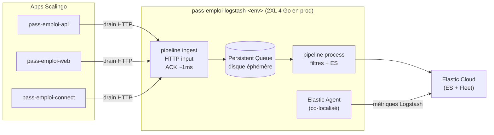
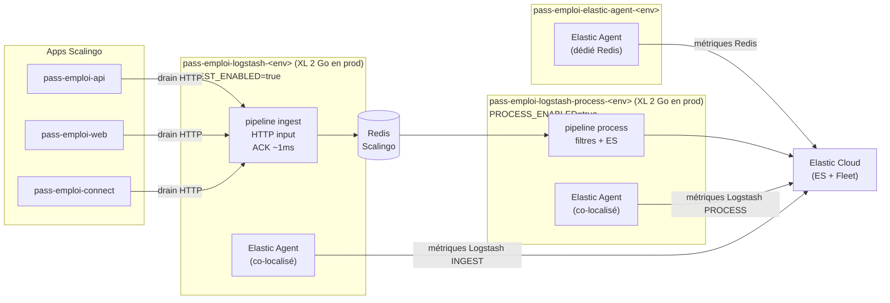

# Migration du buffer Logstash : Persistent Queue disque → cluster Redis

* Statut: accepté
* Décideurs: équipe pass-emploi
* Date: 2026-09-14

## Contexte et Définition du Problème

L'architecture 2 pipelines Logstash (implémentée en 2026-07, cf.
[blackout-logs/conventions.md](../observabilite/ingestion-logs/conventions.md)) utilise une
**Persistent Queue (PQ) disque** comme buffer entre le pipeline `ingest` (ACK
rapide) et le pipeline `process` (filtres + ES). Cette PQ est **éphémère** (disque
Scalingo non persisté) et **co-localisée** dans le même conteneur que les deux
pipelines.

Le problème : faire tourner les deux pipelines dans le même conteneur Scalingo
impose un **conteneur 2XL (4 Go) en prod** pour absorber la JVM Logstash + la PQ +
Elastic Agent. Cela limite le scaling horizontal (coût) et rend la PQ vulnérable aux
restarts du conteneur.

Comment découpler physiquement les deux pipelines pour permettre un scaling
indépendant, tout en conservant le découplage ACK/traitement acquis avec la PQ ?

## Schéma avant/après

### Avant — 1 service Logstash, PQ disque

### Après — 2 services Logstash, Redis comme buffer

## Facteurs de Décision

* **Scaling indépendant** — pouvoir scaler INGEST et PROCESS séparément selon le goulot
* **Résilience** — le buffer ne doit pas être perdu en cas de restart d'un des services
* **Compatibilité Logstash** — support natif dans le plugin `logstash-input-redis` / `logstash-output-redis`
* **Coût** — éviter un broker lourd (Kafka) pour le volume actuel (~1 000–5 000 logs/s)
* **Observabilité** — pouvoir monitorer le buffer (taille de la liste Redis) via Fleet

## Solutions Étudiées

* **Persistent Queue disque (statu quo)** — buffer interne Logstash, éphémère, co-localisé
* **Redis** — broker léger, support natif Logstash, addon Scalingo disponible, observable via Elastic Agent
* **Kafka** — broker robuste, mais surdimensionné pour le volume actuel et sans addon Scalingo natif

## Résultat de la Décision

Solution retenue : **Redis**, car c'est la solution la plus légère compatible avec
le volume actuel, disponible en addon Scalingo, supportée nativement par Logstash
(`redis` input/output), et observable via l'intégration Redis de Fleet/Elastic Agent.

### Impacts Positifs

* Scaling indépendant des services INGEST et PROCESS (conteneurs **XL (2 Go)** au lieu de **2XL (4 Go)** en prod)
* Buffer persisté hors des conteneurs Logstash — survit aux restarts
* Observabilité du buffer (taille de la liste `logstash:ingest` dans Redis) via Elastic Agent dédié
* Nom de l'app INGEST (`pass-emploi-logstash-<env>`) conservé → aucune reconfiguration des Log Drains Scalingo
* Redis persisté via **AOF synchrone** (activé sur l'addon Scalingo) — un restart Redis ne perd pas le buffer en transit

### Impacts Négatifs

* Coût additionnel de l'addon Redis Scalingo
* Complexité opérationnelle accrue (3 apps au lieu de 1 par environnement)
* **Saturation mémoire Redis = crash du cluster** — si ES ou `pass-emploi-logstash-process`
  sont indisponibles, le buffer grossit sans être consommé. À 256 Mo (plan starter
  Scalingo), la saturation peut survenir en moins de 50 min. Dimensionner le plan Redis
  en conséquence et surveiller l'occupation mémoire via Fleet.

## Avantages et Inconvénients des Solutions

### Persistent Queue disque (statu quo)

* Bien, car intégré nativement dans Logstash (zéro dépendance externe)
* Bien, car pas de coût additionnel
* Mauvais, car éphémère (perdu au restart du conteneur)
* Mauvais, car co-localisé — impose un conteneur **2XL (4 Go) en prod** pour les deux pipelines ensemble
* Mauvais, car non observable directement (pas de métrique de taille de queue exposée à Fleet)

### Redis

* Bien, car support natif Logstash (`redis` input/output, plugin officiel)
* Bien, car addon Scalingo disponible (TLS, CA cert, monitoring intégré)
* Bien, car observable via l'intégration Redis de Fleet/Elastic Agent
* Bien, car découplage physique des services → conteneurs **XL (2 Go) en prod** au lieu de 2XL (4 Go)
* Mauvais, car coût additionnel (addon Redis Scalingo)
* Bien, car buffer persisté via **AOF synchrone** (Scalingo) — restart Redis sans perte d'events
* Mauvais, car **saturation mémoire = crash du cluster** si ES ou `logstash-process`
  sont indisponibles — à 256 Mo, saturation possible en < 50 min ; dimensionner le plan
  Redis et surveiller via Fleet

### Kafka

* Bien, car très robuste, persistance garantie, partitionnement
* Mauvais, car surdimensionné pour le volume actuel (~1 000–5 000 logs/s)
* Mauvais, car pas d'addon Scalingo natif — déploiement et opérations complexes
* Mauvais, car coût et complexité opérationnelle élevés

## Liens

* [blackout-logs/conventions.md — Architecture 2 pipelines](../observabilite/ingestion-logs/conventions.md#architecture-2-pipelines-option-a--implémentée-2026-07)
* [logs/README.md — Architecture et déploiement](../../logs/README.md)
* [elastic-agent/README.md — App Elastic Agent dédiée](../../elastic-agent/README.md)
