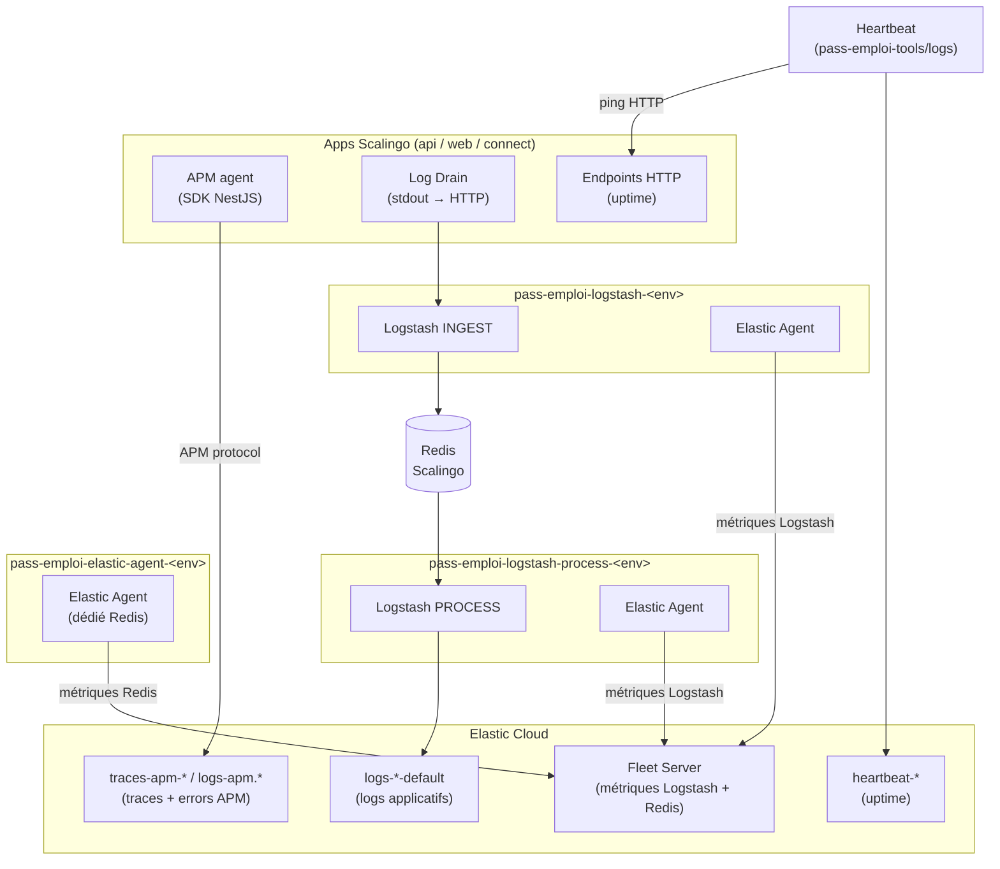

# Observabilité — vue d'ensemble

Vue transverse de l'outillage de supervision de pass-emploi : logs, métriques,
traces distribuées et uptime. Ce fichier est le point d'entrée ; chaque signal
a sa documentation détaillée dans les sous-dossiers référencés.

## Schéma global

## Les quatre signaux

| Signal                          | Outil                                                                         | Data streams ES                                             | Documentation                                                         |
|---------------------------------|-------------------------------------------------------------------------------|-------------------------------------------------------------|-----------------------------------------------------------------------|
| **Logs applicatifs**            | Logstash (drain Scalingo → ES)                                                | `logs-{prod,staging,perf}-default`, `logs-router-*-default` | [logs-ecs/](logs-ecs/README.md)                                    |
| **Traces distribuées & errors** | Elastic APM (SDK NestJS dans api, web, connect)                               | `traces-apm-default`, `logs-apm.error-default`              | [logs-ecs/infra-elasticsearch.md](logs-ecs/infra-elasticsearch.md) |
| **Uptime**                      | Heartbeat (buildpack Scalingo, co-localisé dans `pass-emploi-logstash-<env>`) | `heartbeat-*`                                               | [logs/elastic/README.md](../../logs/elastic/README.md)                |
| **Métriques infra**             | Elastic Agent Fleet (co-localisé dans chaque Logstash + dédié pour Redis)     | via Fleet → Kibana                                          | [elastic-agent/README.md](../../elastic-agent/README.md)              |

## Logs applicatifs

Les apps (api, web, connect) émettent leurs logs en JSON structuré ECS via
`stdout`. Scalingo les achemine via des **Log Drains HTTP** vers Logstash.

Logstash est splitté en deux services depuis 2026-09 :
- **INGEST** (`pass-emploi-logstash-<env>`) : ACK rapide, zéro filtre, écrit dans Redis
- **PROCESS** (`pass-emploi-logstash-process-<env>`) : filtres ECS, indexation ES, DLQ

> Décision d'architecture : [ADR-002 — Migration PQ disque → Redis](../decisions/ADR-002-buffer-redis-logstash.md)

Référence complète : [logs-ecs/](logs-ecs/README.md) — conventions ECS,
data streams, templates, runbook d'astreinte.

## Traces distribuées & errors (APM)

Le SDK Elastic APM est intégré dans les apps NestJS (api, web, connect). Il
capture automatiquement :
- les **traces** de chaque requête HTTP (latence, erreurs, dépendances)
- les **errors** non catchées

Les données sont envoyées directement à Elastic Cloud (APM Server intégré),
sans passer par Logstash.

Rétentions : traces 30 j, errors 90 j — cf.
[logs/elastic/README.md § Observabilité APM & Heartbeat](../../logs/elastic/README.md).

## Uptime (Heartbeat)

Heartbeat est déployé via le buildpack `SocialGouv/heartbeat-buildpack`,
co-localisé dans `pass-emploi-logstash-<env>`. Il effectue des pings HTTP
périodiques sur les endpoints des apps pour détecter les indisponibilités.

Rétention : 90 j.

## Métriques infra (Elastic Agent Fleet)

Deux types d'agents Elastic Agent supervisent l'infra Logstash + Redis :

- **Co-localisés** dans chaque service Logstash (INGEST et PROCESS) : métriques
  Logstash via l'API `/_node/stats` (débit pipelines, taille queue, latence, GC)
- **Dédié** (`pass-emploi-elastic-agent-<env>`) : métriques Redis (taille de la
  liste `logstash:ingest`, mémoire, connexions)

Tous les agents s'enrôlent dans Fleet et reçoivent leur configuration depuis
Kibana → Fleet → Agent Policies.

## Alertes de supervision

Deux types d'alertes coexistent :

- **Alertes Kibana Rules** (infra Logstash + Redis) — notifient via Mattermost
  (`#monitoring-production` et `#monitoring-staging`) :
  [logs/elastic/4-kibana-alerts.md](../../logs/elastic/4-kibana-alerts.md)
- **Alertes Watcher** (signaux applicatifs : pic d'échecs partenaire, erreurs 5xx,
  taux d'auth refusées) :
  [logs-ecs/kibana.md — § Alertes prioritaires](logs-ecs/kibana.md)

Investigation et diagnostic — deux périmètres complémentaires :

- **Signaux applicatifs** (erreurs partenaires, 5xx, auth refusées) — requêtes KQL,
  méthodologies d'analyse par axe (incident, reporting, monitoring) :
  [logs-ecs/kibana.md](logs-ecs/kibana.md)
- **Infra Logstash + Redis** (backpressure, DLQ, silence, backlog Redis) — procédures
  pas-à-pas pour les 5 scénarios de panne :
  [docs/logs-ecs/runbook-astreinte-logstash.md](ingestion-logs/runbook-astreinte-logstash.md)

Signatures des modes de panne et garde-fous durables (quarantaine drain, JVM) :
[docs/blackout-logs/conventions.md](ingestion-logs/conventions.md)

## SLO & indicateurs métier

Les indicateurs de performance (I1 login, I2 parcours, I3 pages critiques) et
leurs seuils (p99 < 500 ms, réussite > 99,5 %) sont définis dans
[docs/perf/observabilite.md](../perf/observabilite.md).

Tirs de charge : le harnais, les scénarios et l'orchestration CI :
[docs/perf/harnais.md](../perf/harnais.md)
