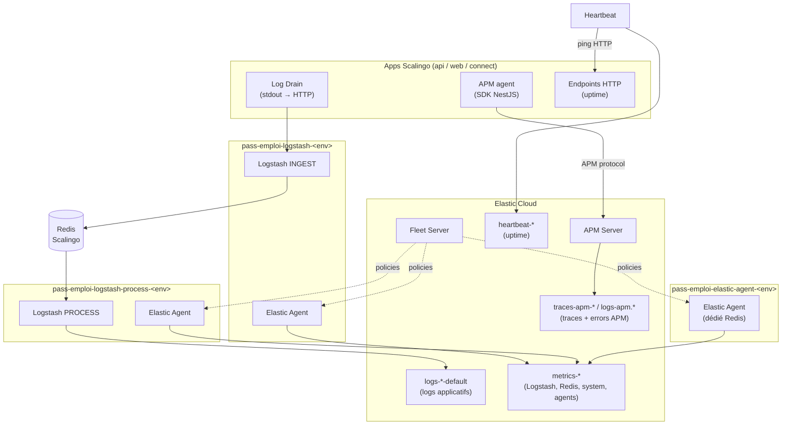

# Infrastructure de la stack d'observabilité — vue d'ensemble

Toutes les briques qui produisent, transportent, stockent et supervisent la
télémétrie de pass-emploi, et les garde-fous qui s'appliquent à leur
dimensionnement. Le détail de chaque étape vit dans son sous-répertoire
(`collecte/`, `process/`, `stockage/`) ; le déploiement de chaque brique dans le
README à côté de son code (`logs/`, `elastic-agent/`, `heartbeat/`).

## Schéma global

## Inventaire

| Brique | Où | Rôle | Doc de l'étape | Déploiement |
|---|---|---|---|---|
| `pass-emploi-logstash-<env>` | Scalingo, process `web`, `INGEST_ENABLED=true` | reçoit les drains → Redis | [collecte/logs](collecte/logs/README.md) | [`logs/README.md`](../../logs/README.md) |
| `pass-emploi-logstash-process-<env>` | Scalingo, process `worker`, `PROCESS_ENABLED=true` | Redis → filtres → ES, DLQ | [process/logs](process/logs/README.md) | [`logs/README.md`](../../logs/README.md) |
| Redis (addon de `…-process-<env>`) | Scalingo | buffer `logstash:ingest` entre les deux services | [process/logs](process/logs/README.md) | — |
| Elastic Agent co-localisé | dans chaque app Logstash | métriques Logstash `/_node/stats` | [collecte/metriques](collecte/metriques/README.md) | [`logs/README.md`](../../logs/README.md#elastic-agent-fleet--configuration-requise) |
| `pass-emploi-elastic-agent-<env>` | Scalingo, process `worker`, 1 instance | métriques des ressources partagées (Redis) | [collecte/metriques](collecte/metriques/README.md) | [`elastic-agent/README.md`](../../elastic-agent/README.md) |
| Heartbeat | Scalingo, process `web` | sondes HTTP d'uptime | [collecte/metriques/disponibilite](collecte/metriques/disponibilite.md) | [`heartbeat/README.md`](../../heartbeat/README.md) |
| SDK Elastic APM | dans api, web, connect | traces + errors | [collecte/traces](collecte/traces/README.md) | repos applicatifs |
| Elastic Cloud (ES, Kibana, Fleet Server, APM Server) | SaaS, un seul cluster pour staging et prod | stockage, pilotage, exploitation | [stockage](stockage/README.md), [pilotage](pilotage.md) | console Elastic Cloud |

Staging et prod partagent **le même cluster ES** ; ils ne diffèrent que par le
nom des data streams.

## Versions

Relevé du 2026-09-30 — vérifier l'état réel avant d'agir.

- **Logstash 9.4.7** et **Elastic Agent 9.4.7** — buildpacks custom (`LOGSTASH_VERSION`,
  `ELASTIC_AGENT_VERSION` ; l'agent doit être ≤ version du cluster).
- **Elastic Cloud 9.4.7** (APM Server compris, version pilotée par le plan) —
  aligné sur Logstash et Elastic Agent. À la prochaine montée de version du
  cluster, monter les buildpacks dans la foulée.
- **Heartbeat 9.1.5** en exécution — buildpack `SocialGouv/heartbeat-buildpack`,
  version fixée par `HEARTBEAT_VERSION` (défaut du buildpack : 7.16.1). La
  variable est déjà à `9.4.7`, mais l'app n'a pas été redéployée : seul le data
  stream `heartbeat-9.1.5` existe. Le nom du data stream suit la version du
  binaire, cf. [montée de version](stockage/metriques/README.md#montée-de-version-heartbeat).
- **Java 21** (upgrade depuis Java 11 via buildpack custom).

## Garde-fous JVM / Scalingo

1. **Conteneur XL Scalingo = 2 Go** (pas 4). Logstash consomme ~0,8-1 Go **hors
   heap** (Netty/direct memory, JRuby, metaspace, threads) + l'OS + l'Elastic Agent
   co-localisé. **`-Xmx2g` sur XL 2 Go = 100 % du conteneur → OOM-kill → restart →
   blackout.** Garder `-Xmx` ≤ ~1 Go.
2. **Conteneur L (1 Go) minimum** : Logstash et Elastic Agent cohabitent. En
   dessous, le boot est tué par l'OOM killer (`Killed ... memory quota exceeded`)
   quel que soit le heap.
3. **Le heap se règle via `LS_JAVA_OPTS`** (ex. `-Xms1g -Xmx1g`), appendé après
   `jvm.options` → override sans redéploiement. **`JAVA_OPTS` n'a aucun effet
   sur Logstash** : le lanceur l'ignore
   (`warning: ignoring JAVA_OPTS=…; pass JVM parameters via LS_JAVA_OPTS`). Les
   post-mortems de juin/juillet 2026 affirment l'inverse : c'est une erreur,
   corrigée ici. Détail : [`logs/README.md`](../../logs/README.md).
4. **`scalingo run` = one-off isolé** : ne voit **pas** le `localhost:9600` de l'app
   (réseau séparé), voit une autre RAM. Non représentatif pour mesurer heap/API.
5. **Poule et œuf sur une app neuve** : Scalingo refuse `scale` tant qu'aucun
   déploiement n'a réussi — procédure de déblocage dans
   [`logs/README.md`](../../logs/README.md#dimensionnement--1-go-minimum).

## Dimensionnement au 2026-09-14

Migration buffer PQ → Redis, cf. [ADR-002](../decisions/ADR-002-buffer-redis-logstash.md).

- **Architecture** : 2 services Logstash séparés (`pass-emploi-logstash-<env>` INGEST +
  `pass-emploi-logstash-process-<env>` PROCESS) + addon Redis Scalingo comme buffer.
- **Prod** : conteneurs **XL (2 Go)** par service (au lieu de 2XL (4 Go) avec PQ).
  En perf/staging avec un débit moindre, des conteneurs L peuvent suffire.
- **Heap** : **`-Xms256m -Xmx256m`** + **`GO_MEMLIMIT=128MiB`** pour l'Elastic Agent
  Go. La mémoire totale monte progressivement jusqu'à ~1,6 Go en prod (off-heap
  Logstash : Netty, JRuby, metaspace + runtime Go de l'agent) → XL nécessaire pour
  tenir sans OOM.
- **⚠️ Risque Redis** : si ES ou `logstash-process` sont indisponibles, le buffer
  grossit sans être consommé → saturation mémoire Redis possible en < 50 min à
  256 Mo. Surveillé par l'alerte 7 ([supervision/alertes](supervision/alertes-stack-observabilite.md)).

Historique des dimensionnements précédents et résultats des tirs :
[process/logs/performances.md](process/logs/performances.md).
