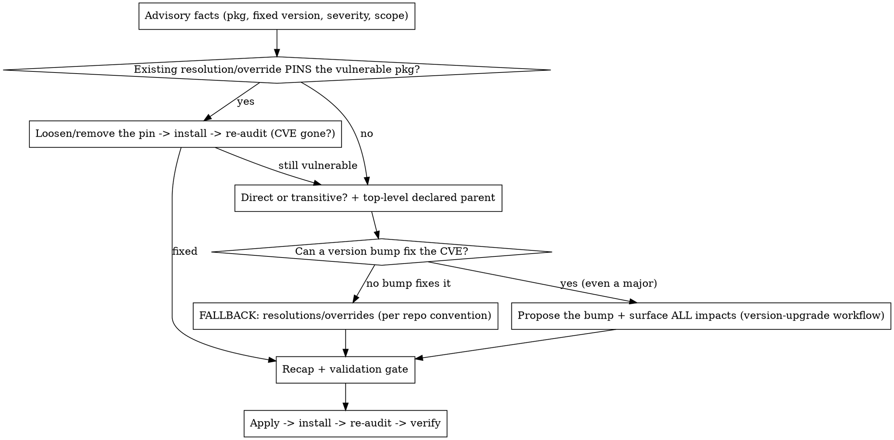

# Fix CVE

## Overview

Fix one dependency vulnerability at a time.

**First, rule out a self-inflicted cause (step 1b):** if the vulnerable package is *already* in `resolutions`/`overrides` with a `^`/exact pin, that pin may be what blocks the fix — loosening it to `>=<fixed>` is the cheapest remediation and short-circuits everything below.

Otherwise: **Strict priority — a version bump that fixes the CVE ALWAYS wins over a `resolutions`/`overrides` pin.** A bump removes the vulnerable version cleanly; a forced pin is a patch that masks the tree. So: **try to fix it with a bump first. If a bump fixes it, do NOT even look at resolutions** — propose the bump and surface its impacts. Only force a version when no bump can fix the CVE (or the user declines the bump after seeing its cost).

Process: investigate → recap → user validation → apply → re-audit. Never edit before the user approves the recap.

Self-contained: needs only the project's package manager + git. When a bump is the fix, delegate the impact analysis to the `upgrade-dependency` skill if installed (it owns target-version choice + breaking-change investigation); only investigate inline if no such skill exists.

## Decision tree — follow in order, do NOT shortcut to resolutions



### 0. Detect the package manager
```bash
ls yarn.lock package-lock.json pnpm-lock.yaml 2>/dev/null   # which lockfile exists
grep '"packageManager"' package.json                        # exact version if set
```
yarn.lock + `packageManager: yarn@4` → **Yarn berry** (commands below use it). Adapt to npm/pnpm otherwise.

### 1. Get the advisory facts
> ⚠️ **The audit and every "resolved" version below reflect the INSTALLED / locked tree, not what `package.json` would resolve to.** If `package.json` or the lockfile were touched since the last install (`git status`, or a recent commit on the deps), run `yarn install` (npm/pnpm equivalent) **first** — otherwise the audit can lie both ways (report a CVE already fixed on paper, or read a stale "resolved" version → faulty investigation). On a clean checkout the tree is already in sync, so don't install reflexively — only when there's a reason to suspect drift.

Details come from the **user** (pasted) or a local audit — do NOT try to read a GitHub/Dependabot page (authenticated even on public repos).
- **Dependabot link only** → ask the user to paste: package, vulnerable version, fixed version, CVE/GHSA id, severity.
- **CVE / GHSA id** → enrich via the public, no-auth CIRCL API: `curl -s https://cve.circl.lu/api/cve/CVE-YYYY-NNNNN`
- Surface it locally: `yarn npm audit --recursive --environment production` (npm: `npm audit`, pnpm: `pnpm audit`).
  - ⚠️ `--environment production` scopes to **prod** dependencies only (the common case). If the CVE is in a **dev** dependency, it won't show — drop the flag or use `--environment all` (yarn) / `npm audit` without `--omit=dev`. Match the flag to the dependency scope you're fixing.

Capture: vulnerable package, current **resolved** version, **fixed** version, severity, prod-or-dev scope.

### 1b. CHECK FIRST — is an existing `resolutions`/`overrides` entry pinning the vulnerable package?
Before any parent-bump analysis, look for the vulnerable package **already listed** in `resolutions`/`overrides`:
```bash
node -p "require('./package.json').resolutions?.['<pkg>'] ?? 'none'"   # yarn (npm: .overrides, pnpm: .pnpm.overrides)
```
A stale pin is frequently the **cause** of the CVE — e.g. `"protobufjs": "^7.5.6"` (= `>=7.5.6 <8.0.0`) blocks the fix when it lands in `8.x`. A `^` or exact pin caps the major and prevents the tree from re-resolving to the fixed version.

If such an entry exists:
1. **Decide remove vs loosen — default to REMOVE, it's the cleaner outcome.** Removing leaves no artificial pin behind; loosening keeps a permanent `resolutions` line that future readers must justify. To decide, look at the ranges *all* consumers request:
   ```bash
   yarn why -R <pkg> | grep "via npm"   # the "(via npm:^x.y.z)" tail is each consumer's own range
   ```
   - **All consumers already request a range that includes the fixed version** → the pin serves nothing → **remove the entry entirely.** (Common case: a stale pin that the tree has long outgrown.)
   - **At least one consumer's range could still resolve to a vulnerable version** without the pin → **loosen to `>=<fixed-version>`** to keep the floor.
   The criterion is "do the natural transitive ranges already cover the fixed version?" — NOT "will the lockfile get updated?" (see the Yarn Berry note below).
2. `yarn install` (npm/pnpm equivalent) to re-resolve.
   > **Yarn Berry re-resolves from scratch.** When a `resolutions` entry is removed or loosened, `yarn install` recomputes the affected packages from the consumers' ranges — it does NOT keep the old locked version just because it still satisfies a constraint. So **removing the pin + `yarn install` is a complete one-step fix; no `yarn up` is needed.** (This differs from npm / yarn v1, whose lockfile would stay pinned to the old satisfying version — do not carry that mental model here.)
3. Re-audit (step 7). **If the CVE is gone → done**, go straight to the recap (step 5) proposing this change.
4. If still vulnerable → restore your reasoning and continue to step 2 (parent bump).

This is checked **before** step 2/3 because removing a self-inflicted cap is lighter than any bump and needs no impact analysis.

### 2. Direct or transitive? Find the TOP-LEVEL declared parent
Print the **full** chain to the workspace root:
```bash
yarn why -R <pkg>        # yarn berry: -R shows the chain to the root (NOT plain `yarn why`)
npm ls <pkg>             # npm
pnpm why <pkg>           # pnpm
```
- In `package.json` deps/devDeps → **direct**.
- Otherwise → **transitive**: identify the **dependency declared in `package.json`** at the top of the chain — that is the only bumpable parent. The *immediate* parent is usually transitive too and NOT in `package.json`.

Example: `@grpc/grpc-js` ← `google-gax` ← `@google-cloud/firestore` ← **`firebase-admin`** (declared). The actionable parent is `firebase-admin`, not `google-gax`.

### 3. PRIORITY — can a version bump fix the CVE? (default remediation once 1b is ruled out)

Once step 1b is ruled out, this is the first thing to check. Compare installed vs latest explicitly:
```bash
node -p "require('<pkg-or-parent>/package.json').version"   # installed
yarn npm info <pkg-or-parent> version                        # latest (npm: npm view <name> version)
```

> ⚠️ **Keep `yarn npm info` output bounded — and beware Yarn Berry's leaky subfields.** NEVER pipe `yarn npm info <pkg> versions --json` raw into node: it dumps the whole history + metadata (thousands of lines) and yarn pollutes stdout, so the JSON parse breaks (`2>/dev/null` is not enough). **`yarn npm info <pkg> dist-tags` is NOT safe either** — Yarn Berry returns the full `versions` array alongside it (~tens of KB). To get just the patched version, select the field yourself:
> ```bash
> yarn npm info <pkg> --json | node -e "process.stdin.on('data',d=>console.log(JSON.parse(d)['dist-tags'].latest))"
> ```
> (npm is well-behaved: `npm view <pkg> dist-tags` / `npm view <pkg> version` are already bounded.)

The choice is **binary** — there is no third path:
- **Direct dependency** (the vulnerable package is in `package.json`) → bump that package to a version satisfying the fixed range.
- **Transitive dependency** → bump the **top-level declared parent** — the dependency that appears in `package.json` (e.g. `firebase-admin`) — so the tree re-resolves the vulnerable package to `>=` fixed.

**The ONLY bump candidate is a dependency declared in `package.json`.** Never evaluate bumping an intermediate transitive package (e.g. `google-gax`, `@google-cloud/firestore`): you cannot bump what the project does not declare. They are just links in the chain — read them to find the declared parent, then stop.

**Never use `yarn up` / a lockfile-only refresh as the remediation.** "The existing range already allows the fixed version" means a *parent bump* will also re-resolve it — it is NOT a reason to skip the parent bump in favour of `yarn up`. A lockfile-only refresh leaves no trace in `package.json` and is exactly the "surgical shortcut" to avoid. The decision is: **parent bump (if it fixes the CVE) → step 5 ; otherwise → resolution (step 4)**. Nothing in between.

**A bump counts as a valid fix even if it is a MAJOR version.** Do NOT discard a major bump just because it looks heavy — that decision belongs to the user, informed by the impacts. Your job is to propose it.

**If a bump fixes the CVE → that IS the remediation. Do NOT compute or propose a `resolutions` entry, and do NOT prepare the fallback "just in case".** The fallback does not exist yet in this conversation — it opens ONLY if the user explicitly declines the bump (step 4). Present the bump alone.

**Delegate the impact analysis — do NOT investigate inline.** When the bump is the remediation, invoke the `upgrade-dependency` skill (via the Skill tool) passing the declared parent package, BEFORE writing the recap. That skill owns the target-version choice (it defaults to the latest stable, one major at a time), the breaking-change / runtime investigation, and the version-range writing convention — so fix-cve does not duplicate those rules. Resume fix-cve only once it returns. (If no version-upgrade skill is installed, fall back to investigating inline: changelog/PRs of the target + grep the repo for affected usages.)

Only proceed to step 4 if **no bump fixes the CVE**, or if the user — after seeing the impacts — explicitly declines the bump and asks for the lighter pin.

Verify the resolved version actually moves: `yarn why -R <pkg>` must show `>=` fixed.

### 4. FALLBACK — force the version (only when no bump fixes it)
Pick the package manager's mechanism and follow the repo's existing convention/format for security pins:
```jsonc
// package.json (yarn) — npm: "overrides", pnpm: "pnpm.overrides"
"resolutions": { "<pkg>": ">=<fixed-version>" }
```
**Always use the `>=<fixed>` form, never `^<fixed>` or an exact version.** A `^` caps the major (`^7.5.6` = `>=7.5.6 <8.0.0`) and will re-create exactly this kind of CVE the day the fix moves to the next major — `>=` lets the tree resolve to any safe newer version. (Project standard, see CLAUDE.md.) If the repo already has `^`/exact security pins, flag them in step 4b as candidates to normalise to `>=`.

> **A `resolutions`/`overrides` entry is GLOBAL and collapses ALL instances to a SINGLE version** — it overrides every consumer's declared range and resolves to the highest version satisfying the entry. So when several parents pull *different vulnerable majors* (e.g. `form-data` 2.5.5 via one chain and 4.0.5 via another), **one entry fixes them all at once** — they all collapse to the same resolved version. Two consequences:
> - **Anchor the `>=` floor on the major that will actually be installed, not the lowest vulnerable major.** With patches at 2.5.6 / 3.0.5 / 4.0.6, writing `>=2.5.6` resolves to 4.0.6 anyway (highest available) — so write `>=4.0.6` directly. Same lockfile, but the entry honestly states the version really installed instead of implying 2.x is tolerated. Find that version with `yarn npm info <pkg> dist-tags` (the `latest`) and confirm with `yarn why -R <pkg>` after install.
> - A type-only consumer (e.g. `@types/request`) being forced onto another major is harmless (never executed) — but **confirm non-regression with `yarn install` + build, don't just assert it.**
```bash
yarn install   # regenerate the lockfile with the forced version
```
⚠️ A forced version is GLOBAL (all consumers); if one needs an incompatible major it breaks → re-test. Keep it traceable (it documents the CVE). Verify: `yarn why -R <pkg>`.

### 4b. Resolutions hygiene (Boy Scout — non-blocking)
While in `package.json`, scan existing `resolutions`/`overrides` for:
- entries now obsolete (the tree resolves safely without them) → propose removing them;
- entries using `^`/exact instead of `>=` → propose normalising to `>=` (they are latent CVE traps, per the project standard).
Propose changes in the recap; never remove/loosen without confirming the tree stays safe.

### 5. STOP — recap & validation gate (mandatory)
Present and **wait for go**:
```
## Recap — fix <CVE/GHSA> (<severity>, CVSS <score>)
- Package: <pkg> <current> → fixed in <version>
- Dependency: direct / transitive (top-level declared parent: <parent>, installed <v> vs latest <v>) — prod / dev
- Remediation (PRIORITY = bump):
    bump <pkg|parent> to <v> → resolved <pkg> becomes <v> (≥ fixed: yes)
    Impacts: <breaking changes / "none, same major" — from the upgrade investigation>
- Fallback (only if you decline the bump or no bump fixes it):
    resolutions/overrides entry "<pkg>": ">=<fixed>"
- Resolutions cleanup (optional): <obsolete entry, or none>

Nothing changed yet — proceed with the bump?
```
If the fix came from **step 1b** (an existing pin), the recap is simpler — replace the remediation/fallback lines with one of:
- `Remediation: remove obsolete resolution "<pkg>": "^<v>" (all consumers already request ≥ fixed; CVE confirmed gone after re-audit)`
- `Remediation: loosen existing resolution "<pkg>": "^<v>" → ">=<fixed>" (CVE confirmed gone after re-audit)`

In a non-interactive context, stop here and return the recap.

### 6. Apply the validated fix
- Edit `package.json` (bump or, if chosen, resolution), preserving the repo's version-range convention. If several `package.json` reference the package (monorepo), update **all** instances, keeping each prefix.
- Install: `yarn install` (npm: `npm install`, pnpm: `pnpm install`).
- `git status` → only `package.json` + lockfile (and refactored files if a bump needed code changes) should differ; investigate anything unexpected.

### 7. Verify the CVE is gone
```bash
yarn npm audit --recursive --severity high --environment production   # Yarn berry (prod deps)
npm audit                                                             # npm
```
Use the **same scope as the fix**: `--environment production` for a prod dependency, or drop it / `--environment all` if the CVE was in a dev dependency (otherwise the re-audit can't confirm it's gone).
Fixing ONE CVE → do not require zero findings; confirm the **specific** package/advisory no longer appears. Then run the project's build / lint / test (a bump or a forced version can break things) — or hand off if the repo convention is that the human runs them (check `CLAUDE.md`).

### No patch available
No fixed version yet → do NOT improvise. Surface options: mitigate (config/feature flag), remove/replace the package, or accept the risk **documented**. Let the user decide.

## Red Flags — STOP

- **Jumping to parent-bump analysis without checking existing `resolutions`/`overrides` first** → a stale `^`/exact pin on the vulnerable package is often the cause; loosen it to `>=` and re-audit before anything heavier (step 1b).
- **Keeping (loosening) a pin that should be removed** → if all consumers already request a range covering the fixed version, the pin is dead weight; default to removing the entry, don't loosen "to be safe" (step 1b).
- **Assuming `yarn install` keeps the old locked version after removing a pin (so "you also need `yarn up`")** → Yarn Berry re-resolves removed/loosened `resolutions` from scratch; remove + `yarn install` is the complete fix. That stale-version assumption is the npm / yarn v1 model.
- **Writing a `resolutions` pin as `^<fixed>` or an exact version** → use `>=<fixed>`; `^` caps the major and re-creates the CVE on the next major.
- **Reaching for `resolutions` when a version bump would fix the CVE** → a bump is the priority; resolutions is a fallback only.
- **Concluding "the range already covers the fix, so `yarn up` suffices"** → the range covering the fixed version is a reason to skip *resolutions*, NOT a reason to skip the *parent bump*. Check the declared parent bump first.
- **Evaluating an intermediate transitive (e.g. `google-gax`) as a bump target** → only `package.json`-declared dependencies are bumpable. Find the declared parent and bump that, or fall back to a resolution on the vulnerable package.
- **Computing or investigating the `resolutions` fallback before the user declines the bump** → reading existing `resolutions`, checking intermediate transitives like `google-gax`, or drafting a pin while the bump is still on the table. Present only the bump; the fallback path opens on explicit rejection.
- Discarding a major bump on your own ("too heavy") instead of proposing it with its impacts.
- **Investigating bump impacts inline instead of delegating to `upgrade-dependency`** when that skill is installed → duplicates its target-version and breaking-change rules.
- **Dumping `yarn npm info <pkg> versions --json` (or any full version list) into the conversation/node** → query `version`/`dist-tags` only; the raw dump is huge and breaks JSON parsing.
- **Writing the `resolutions` `>=` floor on a lower major than what actually installs** (e.g. `>=2.5.6` when the tree collapses to 4.0.6) → anchor it on the resolved major so the entry states the truth.
- Claiming a parent is "already latest" without comparing installed vs `yarn npm info <parent> version`.
- Claiming "fixed" without re-auditing and checking the resolved version ≥ fixed.
- Editing before the recap is validated.
- Committing / pushing / opening a PR without being asked.

## Common Mistakes

- **Defaulting to resolutions because it's "surgical"** → if a bump fixes the CVE, propose the bump (+ impacts) first; only fall back to resolutions if no bump fixes it or the user declines.
- **Using `yarn up` / lockfile-only refresh as the fix** → it is not a bump and not a resolution; it is the forbidden middle path. If `yarn up` could move the transitive version, the parent bump can fix it too — propose the parent bump.
- **Confusing the immediate parent with the top-level declared one** → only the `package.json` dependency is bumpable; use `yarn why -R`.
- **Evaluating a non-declared intermediate (google-gax…) as a bump target** → not bumpable; bump the declared parent or use a resolution.
- **Bump that doesn't move the transitive version** → looks fixed, audit still red.
- **Override that breaks a consumer** needing an incompatible major.
- **Treating a dev-only CVE as a prod emergency** → note the scope.
- **Hardcoding npm** → adapt to the project's package manager.

## Optional: open a PR
Only if the user asks. Then a security-focused commit/PR mentioning the CVE, severity, package, current→fixed version, and the verification done.
