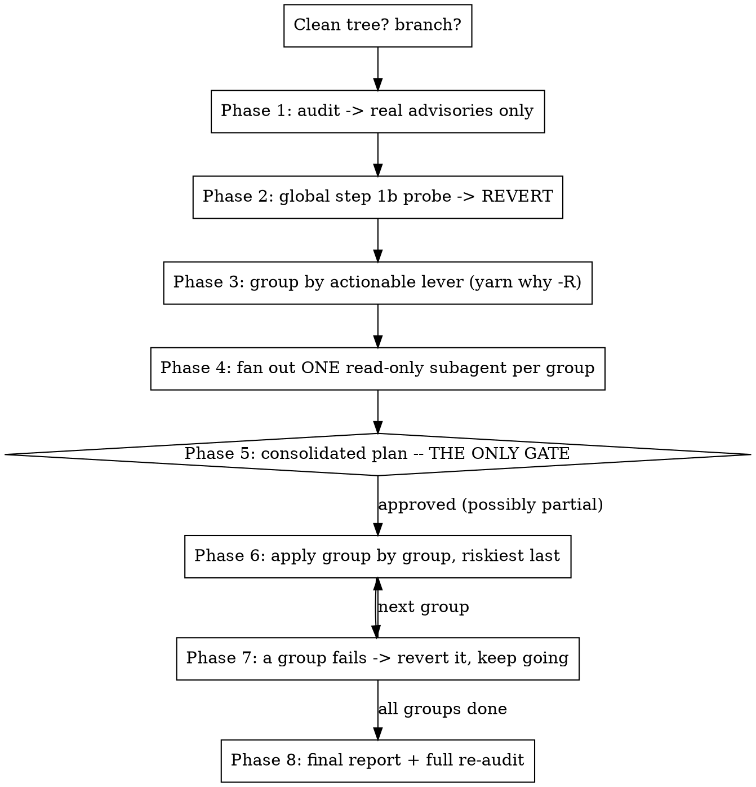

# Multi-CVE regime — fix every CVE in a repo

Loaded from `SKILL.md` step 0 when **2 or more** advisories are in scope.

**Contract: ONE validation gate — the consolidated plan (phase 5).** Everything before it is
read-only or reverted; everything after it is execution, not decision. If you find yourself
about to ask the user a second question, you have broken the regime.

`SKILL.md` still owns the remediation rules (decision tree, step 1b, bump > resolutions,
`>=` pin form, red flags). This file owns collection, grouping, planning, applying.

## Hard precondition — clean working tree

```bash
git status --porcelain
```
Not empty → **STOP** and say so. Without a clean tree you cannot tell your changes from
pre-existing ones, cannot revert a failed group, and cannot commit per group. Ask the user to
commit or stash first.

Also: if on `master`/`develop`, create a branch before the first commit (phase 6).

## Process



### Phase 1 — collect the real advisories

```bash
yarn npm audit --recursive --environment production --json > /tmp/audit.ndjson
```
NDJSON, one object per line (see `SKILL.md` step 1 for the field layout). Parse it and
**drop the deprecation notices** — `ID` matching `(deprecation)` and no `URL`. They are not
vulnerabilities; on `pass-emploi-api` they were 8 lines out of 30.

```bash
node -e "
const rows=require('fs').readFileSync('/tmp/audit.ndjson','utf8').trim().split('\n').map(l=>JSON.parse(l));
const vuln=rows.filter(r=>!String(r.children.ID).includes('deprecation'));
for (const r of vuln) console.log([r.children.Severity, r.value, r.children['Tree Versions'].join(','), r.children['Vulnerable Versions'], r.children.URL].join(' | '));
console.log('advisories:', vuln.length, '/ lines:', rows.length);
"
```

Per advisory, record: package, resolved version (`Tree Versions`), fixed version (upper bound of
`Vulnerable Versions`), severity, GHSA id (tail of `URL`).

> ⚠️ **The same package often carries SEVERAL advisories with different fixed versions.** On
> `pass-emploi-api`, `brace-expansion@5.0.4` has three: `<5.0.5`, `<5.0.6`, `<5.0.7`. The floor
> to target is the **highest** of them (`5.0.7`) and the severity to report is the **max**
> (`high`). Anchoring on the first one you read leaves the others red and the fix looks done
> when it isn't. Same rule as `SKILL.md`'s "anchor the `>=` floor on the major that will
> actually be installed", one level up.

Scope is **prod** (`--environment production`). If the user explicitly asks for dev too, use
`--environment all` and carry the scope into the plan — a dev-only CVE is not a prod emergency.

### Phase 2 — run step 1b ONCE, globally, then revert

`SKILL.md` step 1b (a stale `^`/exact pin on the vulnerable package is often the *cause* of the
CVE) is per-CVE. Here, do it **in one pass for all of them**: it is the cheapest remediation and
it can remove CVEs from the list before you investigate a single bump.

1. List the advisories whose package already appears in `resolutions`/`overrides`.
2. Apply step 1b's remove-vs-loosen rule to each (default: **remove**).
3. **One** `yarn install`, **one** re-audit. Note exactly which advisories disappeared.
4. **Revert the probe:**
   ```bash
   git checkout -- package.json yarn.lock && yarn install
   ```

Why revert: this is the only phase that writes before the gate, and the gate must be able to
say "nothing has changed yet" truthfully. The probe result is kept as a *verified* fact in the
plan ("probed: clears GHSA-x, GHSA-y") rather than a guess. Cost: one extra install. Accepted.

In a monorepo with several `package.json`, probe all of them together.

### Phase 3 — group by actionable lever, BEFORE any fan-out

For each remaining advisory, `yarn why -R <pkg>` (read-only) gives the grouping key:

| Situation | Key | Why |
|---|---|---|
| Exactly one **top-level declared** parent | that parent | one bump clears every CVE under it |
| Several declared parents for the same vulnerable package | the vulnerable package | no single bump can do it → `resolutions` candidate (one entry collapses all majors) |
| The vulnerable package is a direct dependency | itself | its own group |

Do NOT group on the audit's `Dependents` field: that is the **immediate** parent, usually
transitive and not bumpable (`SKILL.md` step 2). On `pass-emploi-api` it groups at most 2
advisories, while the declared parent groups far more.

Group first, fan out second. Skipping this makes N subagents investigate the same bump.

### Phase 4 — fan out one read-only subagent per group

One subagent **per group** (not per CVE). Each applies `SKILL.md` steps 1b→4 to its group and
returns a structured recap: chosen remediation, target version, impacts / breaking changes, CVEs
covered, risk level (low = pin removal or patch/minor, medium = `resolutions`, high = major or
package migration).

Both skills already stop before writing when nobody can answer (`fix-cve` step 5 and
`upgrade-dependency` step 5: *"In a non-interactive context, stop here and return the recap"*).
Say so explicitly in the subagent prompt so it returns the recap instead of waiting.

> **⚠️ NO SUBAGENT WRITES. EVER.** No `package.json` edit, no `yarn install`, no `yarn up`, no
> commit. They all share one working tree: a single concurrent `install` rewrites the lockfile
> under every other subagent, so their `yarn why -R` and audit readings become lies and every
> investigation in flight is silently wrong. This is the one real hazard of this design.

If there are many groups, dispatch in waves of ~5.

### Phase 5 — the consolidated plan: the ONLY gate

Sort groups **least risky first**: probed pin removals → patch/minor bumps → `resolutions` →
majors. Then present:

```
## Plan — <N> CVEs (<crit>/<high>/<mod>/<low>), prod scope, in <G> groups

| # | Lever | CVEs cleared | Max sev | Impacts | Risk |
|---|-------|--------------|---------|---------|------|
| 1 | remove obsolete resolution "<pkg>" | GHSA-x, GHSA-y | high | none (probed: verified) | low |
| 2 | bump <parent> <v1> → <v2> | GHSA-z | critical | same major, no breaking change | low |
| 3 | resolutions "<pkg>": ">=<fixed>" | GHSA-a, GHSA-b | moderate | collapses 2.x and 4.x to <v> | medium |
| 4 | bump <parent> <v1> → <v2> (MAJOR) | GHSA-c | high | <breaking changes + files to touch> | high |

Out of plan — needs a separate decision:
- <pkg> (GHSA-d): no patch available anywhere → mitigate / replace / accept documented
- <pkg> (GHSA-e): package migration (<old> → <new>) → separate investigation

Nothing has changed yet (the pin probe was reverted).
Apply groups 1-4? You can drop any of them in your answer — I won't ask again after this.
```

Two rules for this gate:

- **It must accept a partial answer in one round.** "Yes, but not group 4" is a complete answer.
  If the user has to answer twice to exclude a group, the regime has failed.
- **"Out of plan" items are named, not executed.** No-patch cases and package migrations
  (`SKILL.md`'s "check the advisory's package name" section) need a decision the plan cannot
  bundle.

In a non-interactive context, stop here and return the plan.

### Phase 6 — apply, group by group, riskiest last

Per approved group:
1. Edit `package.json` (all instances in a monorepo), keeping the repo's range convention.
2. `yarn install`.
3. `yarn why -R <pkg>` → **confirm the resolved version actually moved** to ≥ fixed. This is
   the check that catches a bump that looks right and fixes nothing.
4. Commit that group alone:
   `fix(deps): monte firebase-admin 12 → 13 (GHSA-xxxx, GHSA-yyyy)`

One `install` per group is required by the per-group commit — G installs, not one. G ≤ N after
grouping, which is the saving.

**Tests:** do not build+test after every group (too slow at G groups). Run the repo's
build/lint/test **once at the end**, plus **immediately after any high-risk group** (major /
code changes) — those are the only serious suspects. If the final pass fails, the per-group
commits make the culprit trivial to isolate: that is what the split buys. If the repo's
convention is that the human runs the tests (check its `CLAUDE.md`), hand off instead.

No push, no PR unless asked.

### Phase 7 — a group fails: isolate it, never block

All three cases are handled **without a new gate**:

- **Resolved version didn't move** → `git checkout -- package.json yarn.lock && yarn install`,
  record "bump had no effect", next group.
- **Build/types break** and the approved plan did not announce code changes → revert the group,
  record it, next group. If the plan *did* announce the refactor, it is approved work: do it.
- **Improvising a different remediation is forbidden.** Falling back to a `resolutions` pin when
  the approved plan said "bump" is outside the approved plan. Record the failure; do not
  quietly rescue it. This is what protects the value of the single gate — the user approved
  *those* changes, not "whatever works".

### Phase 8 — final report

```
## Done — <k>/<N> CVEs cleared

| Group | CVEs | Status |
|---|---|---|
| 1 | GHSA-x, GHSA-y | applied, commit <sha> |
| 4 | GHSA-c | reverted — build broke on <file>, needs the refactor |

Remaining: <pkg> GHSA-d (no patch), <pkg> GHSA-e (migration, out of plan)
Re-audit: <n> advisories left (was <N>)
Verification: <build/test result, or "handed off per repo convention">
```

Then a full re-audit at the same scope as the fixes, and list every remaining CVE **with its
reason**. Never report "all CVEs fixed" without that re-audit output.

## Red Flags — STOP

- **Asking for any validation after the plan was approved** → the plan is the gate.
- **A subagent writing to `package.json` or running an install** → corrupts the tree for every
  other subagent in flight.
- **Fanning out before grouping** → redundant investigations of the same bump.
- **Grouping on the audit's `Dependents`** → that's the immediate parent, not the bumpable one.
- **Counting deprecation notices as CVEs** → filter `(deprecation)` in phase 1.
- **Targeting the lowest fixed version when a package has several advisories** → aim at the
  highest floor, or the group ships half-fixed.
- **Starting on a dirty working tree** → no revert, no per-group commit possible.
- **Skipping the phase 2 revert** and letting the probe ride into the gate → the plan then lies
  about "nothing has changed".
- **Substituting a remediation when a group fails** → out of the approved plan; record and move on.
- **Committing all groups as one commit** → kills the isolation the whole design is built on.
- **Claiming success without the final re-audit.**
