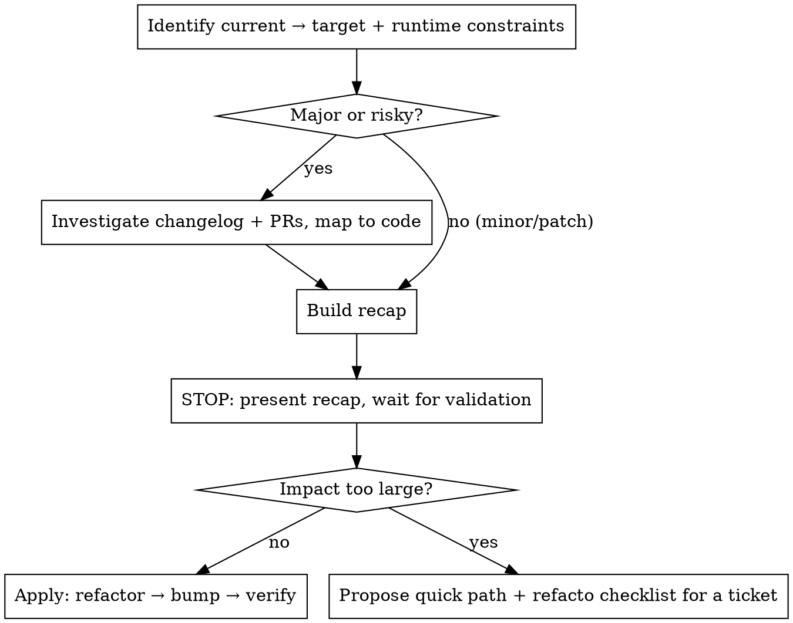

# Upgrade Dependency

## Overview

Single entry point for ANY version bump. You do NOT need to know in advance whether there are breaking changes — this skill investigates, decides the depth, and **always reports back for validation before changing anything**.

**Core principle: investigate first, report, get explicit user validation, THEN act. Never modify code or bump `package.json` before the user has approved the recap.**

### Self-contained — with optional delegation

This skill is standalone: it requires nothing beyond the project's standard tooling (npm/yarn/pnpm, git). It does NOT depend on any other skill, so it stays portable and shareable as-is.

The mechanical bump is trivial and done inline:
- **Targeted upgrade of one named package** (e.g. "monte firebase-admin") → edit the `package.json` range + run install. That's it.
- **Bulk / "update my dependencies"** → list candidates and apply the safe ones:
  ```bash
  npm outdated            # or: yarn outdated / pnpm outdated
  # apply minor/patch within range; treat each major via this skill's workflow
  ```

**Optional:** if a dedicated dependency-update / bump skill happens to be installed, you MAY invoke it for the bulk mechanical sweep — but never require it. Skills do not call each other automatically; "use it" means you choose to invoke it via the Skill tool, and only when it adds value (bulk/multi-language). For a single targeted upgrade it adds nothing. This skill remains the brain that decides what is safe and what needs investigation.

### Effort tiering (resource optimization)

Match the effort to the step instead of doing everything at one level:

- **Keep on the current (strong) model — judgment work:** investigating breaking changes, reading PR/migration diffs, mapping to code, the refactor, the recap.
- **Consider offloading to a cheaper subagent — bulk mechanical work only:** wide greps across a large/monorepo codebase, reading many files, scanning several repos for the same dependency. The point is to keep the main context clean, not to "save tokens" on a couple of commands.
- **Never offload a handful of commands** (`npm view`, one `grep`, reading `package.json`): the subagent spin-up + context transfer costs more than it saves.
- This pays off most in the **multi-repo** case: a light agent per repo to answer "does it use X + where", with the investigation centralized once on the strong model.
- Do not spawn subagents unless the user asked or the fan-out is genuinely large; express it as an option, not an automatism.

## Workflow



### 1. Identify versions & choose the target
Read the current version (installed + the `package.json` range) and pick the target:

**Default target when the user did not specify a version: the latest STABLE, but ONE MAJOR AT A TIME.**
- If the latest is within the same major → go to latest.
- If several majors behind (e.g. 13 → 16) → target only the **next** major (13 → 14). Each major is a separate investigation + upgrade; never chain them silently.
- **Ignore pre-releases** (beta / rc / next / alpha / canary dist-tags) unless the user explicitly asks for one.
- Note: the `package.json` `^`/`~` range only allows minor/patch. Reaching a new major REQUIRES editing the range — that is an explicit change, shown in the recap.

Then read what the target requires:
```bash
npm view <pkg>@<target-version> version engines peerDependencies type exports
```
Release notes are vague about runtime; the metadata is not. Confirm first:
- **Node / peer versions** satisfy `engines` / `peerDependencies`.
- **Module system**: if the package now ships **ESM-only** (`"type": "module"`, and `exports` has no `require`/CJS condition), check the project's build (`tsconfig` `module`, or `"type"` in its `package.json`). An ESM-only package consumed from a CommonJS build breaks at runtime (`ERR_REQUIRE_ESM`) even when `tsc` passes — this is a frequent, silent major breaking change. Plan a dynamic `import()` or flag it as a blocker.

**Always state the chosen target in the recap so the user can confirm or redirect it.**

### 2. Decide the depth
- **Minor / patch**: low risk. Note it, no deep dig needed. Apply it inline (see "Self-contained" above); an external bump skill is optional, never required.
- **Major / security / suspicious**: investigate (step 3).

### 3. Investigate breaking changes — drill past the release notes
Release notes summarize and omit detail. For each breaking change, go to the artifact that carries the **real API delta**:
- **Linked PR diff** — best for a discrete change (a symbol removed/renamed); shows exactly which symbols and files.
- **Migration guide** — best for a full rewrite or large reorg, where there is no single PR.

Use whichever applies. The goal is to know the concrete before/after API, not the marketing line.

### 3b. Health check (Boy Scout Rule — non-blocking)
While you have the package open, check whether it is still a good choice:
```bash
npm view <pkg> deprecated time.modified maintainers
```
Flag (do NOT act on it without the user's go) if:
- the package is **deprecated** (npm `deprecated` field set), or
- it is clearly **unmaintained** (no release in a long time, archived repo), or
- there is a **clearly more modern, widely-adopted alternative** you genuinely know (e.g. moment → luxon/date-fns, request → axios/fetch).

Only raise alternatives you are confident about — if you are not sure a modern replacement exists, say nothing rather than guess. Surface findings as a suggestion in the recap (step 5), separate from the upgrade itself.

### 4. Map each breaking change to the code
Grep the codebase for affected symbols → impact table:

| Breaking change | Usage in repo? | Impact |
|---|---|---|
| `X removed` | `grep -rn "X" src/` → N hits | refactor needed / none |

Zero hits = ignore. Hits = scope the edit.

### 5. STOP — recap & validation gate (mandatory)
Present a recap and **wait for the user to validate before touching anything**. Use this template:

```
## Recap — upgrade <pkg> <current> → <target>
- Target: <version> (<n> major(s) up). Health: <maintained / deprecated / …>
- Runtime: Node/peer <OK / problem>; module system <CJS-OK / ESM-only blocker>
- Breaking changes: YES / NO
  | Breaking change | Usage in repo | Impact |
  | … | grep → N hits | refactor / none |
- Recommendation: <simple bump | refactor (scope) | too big → quick path + ticket>
- Boy Scout note (optional): <deprecated / modern alternative, or "none">

Nothing changed yet — which path do you want?
```

Do not proceed to edits until the user says go. In a non-interactive context (no user to answer), stop here and return the recap as the final output rather than guessing.

### 6. Act on the validated plan
- **No / small impact** → refactor the affected code FIRST, then bump `package.json`, then install. Never bump before the refactor compiles.

  **Version-writing convention (default):** write the range as `^<new-major>.0.0` (caret locks the major, allows minor/patch) — e.g. `13.10.0` or `^13.10.0` → `^14.0.0`. Apply this regardless of the previous format. **Exception: if the repo has an explicit code standard for version ranges (e.g. all deps exact-pinned, a `.npmrc`/lint rule, a documented convention in CLAUDE.md), that standard ALWAYS wins over this default** — detect it from the existing `package.json` style or repo docs before writing.
- **Impact too large** → do NOT silently do a huge refactor. Instead:
  1. Propose a **quick path** to unblock now (e.g. stay on current major, pin, partial upgrade, compatibility shim, or upgrade only what's safe).
  2. Produce a **complete refacto checklist** the user can paste into a ticket: every file/symbol to change, the new API, estimated scope, order of operations.

### 6b. Resolutions hygiene after the bump (Boy Scout — non-blocking)
After an upgrade, an existing `resolutions`/`overrides` entry may have become obsolete (it was forcing a version that the dependency tree now resolves safely on its own — e.g. because you just bumped a parent). Scan `package.json` for entries related to what changed and, if the tree resolves safely without them, propose removing them. Never remove without confirming the resolved tree stays safe.

### 7. Verify per project conventions
Run — or, if the project convention is that the human runs them, hand off explicitly — the project's build, lint and test. Check `CLAUDE.md` / `package.json` scripts for the exact commands and who runs them.

## Red Flags — STOP

- About to edit code or bump `package.json` **before** the user validated the recap → STOP, present the recap first.
- About to do a large refactor without offering the quick path + ticket option → STOP, give the user the choice.
- Relying on release notes without opening the PR diff / migration guide → STOP, the detail is there, not in the summary.

## Common Mistakes

- **Bumping first, investigating after** → broken tree, errors with no map.
- **Trusting release notes** → they omit detail; the PR diff / migration guide is the truth.
- **Skipping the impact grep** → over-worry about irrelevant changes or miss a real one.
- **Forgetting `engines`** → fails to install on the target runtime.
- **Missing an ESM-only switch** → `tsc` passes but it crashes at runtime (`ERR_REQUIRE_ESM`) in a CommonJS build.
- **Acting before validation** → the recap + go/no-go is mandatory.
- **Hardcoding npm** → adapt to the project's package manager (yarn/pnpm/…).

## Real-World Note

firebase-admin v13→v14: release notes said "remove legacy namespace support" (vague). The PR #3164 revealed `admin.firestore()` / `admin.auth()` / `admin.initializeApp` were deleted for modular imports — a refactor across 3 files. `npm view` exposed an `engines: node>=22` not highlighted in the notes. Neither was visible from the release notes alone.